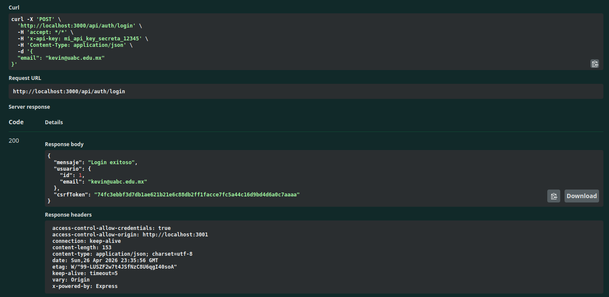
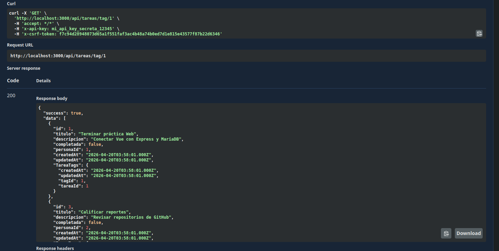
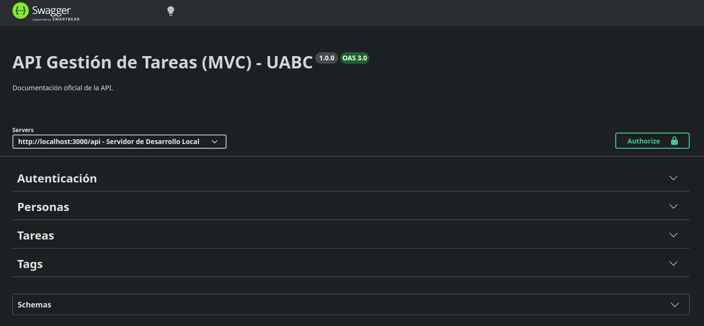

# Sistema Fullstack - Gestión de Tareas Seguro

Este proyecto es una solución integral dividida en una API RESTful (Node.js, Express, MariaDB) y una aplicación cliente reactiva (Vue 3, Vuetify 3). Implementa una arquitectura MVC para la gestión de usuarios, tareas y etiquetas, incluyendo relaciones complejas, búsquedas avanzadas cruzadas y un robusto sistema de autenticación de seguridad basado en roles.

**Autor:** Kevin Yassir Felix Sanchez
**Institución:** Universidad Autónoma de Baja California - Ingeniería en Computación

---

## Arquitectura y Tecnologías

**Backend:**
- Node.js & Express
- Base de datos: MariaDB
- ORM: Sequelize
- Seguridad: JWT (HttpOnly Cookies), CSRF Tokens, Bcryptjs para contraseñas.
- Documentación: OpenAPI (Swagger)

**Frontend:**
- Framework: Vue 3 (Composition API)
- UI Library: Vuetify 3
- Enrutamiento: Vue Router (con Navigation Guards)
- Testing E2E: Playwright

---
### 1. Levantar el Backend
1. Clonar el repositorio y navegar a la carpeta del servidor.
   ```bash
   git clone [https://github.com/KevinFelix1563/DAW_Meta3.4_FelixKevin](https://github.com/KevinFelix1563/DAW_Meta3.4_FelixKevin)
   cd backend_tareas
   npm install
   ```
2. Crear un archivo `.env` en la raíz del backend:
   ```env
   PORT=3000
   CLIENT_URL=https://localhost:3001
   JWT_SECRET=mi_secreto_super_seguro_para_jwt_2024
   JWT_EXPIRES_IN=1h
   API_KEY=mi_api_key_secreta_12345
   COOKIE_MAX_AGE=3600000
   CSRF_TOKEN_SECRET=mi_secreto_csrf_super_seguro
   ```
3. En el gestor de MariaDB, crear la base de datos `tareas_db`.
4. Ejecutar Migraciones y Seeders:
   ```bash
   npx sequelize-cli db:migrate
   npx sequelize-cli db:seed:all
   ```
5. Iniciar el servidor (escuchando en `https://localhost:3000`):
   ```bash
   npm run dev
   ```

### 2. Levantar el Frontend
1. Abrir una nueva terminal y navegar a la carpeta del cliente.
   ```bash
   cd frontend_tareas
   npm install
   ```
2. Crear un archivo `.env` en la raíz del frontend:
   ```env
   VITE_API_URL=https://localhost:3000/api
   VITE_API_KEY=mi_api_key_secreta_12345
   ```
3. Iniciar el servidor de desarrollo:
   ```bash
   npm run dev
   ```

---

## Documentación OpenAPI (Swagger)
La API cuenta con documentación interactiva alojada de manera local.
1. Navegar a: **[https://localhost:3000/api-docs](https://localhost:3000/api-docs)**.
2. **Autenticación Inicial:** Utilizar el botón `Authorize` ingresando la `API_KEY` en el recuadro `ApiKeyAuth`.
3. Iniciar sesión en `/auth/login` con el usuario de prueba (ej. `kevin.felix59@uabc.edu.mx`).
4. **Seguridad CSRF:** De la respuesta del login, copiar el `csrfToken` e ingresarlo en el recuadro `CsrfAuth` del botón `Authorize`.


---
 
### Evidencias de Ejecución de Backend en Swagger
Demostración de autenticación JWT.


Demostración de consulta de Tareas por Etiqueta, en este caso TagId=1 o Urgente.


Interfaz de documentación generada.


## Evidencias de Ejecución de Frontend en PlayWright

Para asegurar la calidad y el cumplimiento estricto de la rúbrica, se desarrollaron suites de pruebas automatizadas que cubren el 100% de los flujos de la aplicación (Autenticación, Gestión de Usuarios, CRUD de Tareas/Etiquetas y Búsquedas Avanzadas). Todas las pruebas pasan exitosamente.

A continuación, se presenta la evidencia en video de las pruebas End-to-End:

#### Panel de Administración (Gestión y Búsquedas)

**1. Listar y Crear un Nuevo Usuario**
Evidencia de la creación de un usuario desde el panel del Administrador:
https://github.com/KevinFelix1563/DAW_Meta3.4_FelixKevin/raw/main/frontend_tareas/test-results/admin-Panel-de-Administrac-bcacf--usuarios-y-crear-uno-nuevo-chromium/video.webm

**2. Búsquedas Avanzadas (Admin)**
Evidencia de consultas cruzadas en la base de datos (Ej. Búsqueda de tareas por etiquetas):
https://github.com/KevinFelix1563/DAW_Meta3.4_FelixKevin/raw/main/frontend_tareas/test-results/admin-Panel-de-Administrac-26281--búsquedas-avanzadas-Admin--chromium/video.webm

**3. Eliminar un Usuario (Confirmación)**
Evidencia del borrado de un usuario aceptando el diálogo nativo de confirmación:
https://github.com/KevinFelix1563/DAW_Meta3.4_FelixKevin/raw/main/frontend_tareas/test-results/admin-Panel-de-Administrac-9152c-ario-confirmando-el-dialogo-chromium/video.webm

#### Gestión de Tareas (Usuario Regular)

**1. Crear una Nueva Tarea**
Evidencia de un usuario autenticado agregando exitosamente una tarea a su lista:
https://github.com/KevinFelix1563/DAW_Meta3.4_FelixKevin/raw/main/frontend_tareas/test-results/tareas-CRUD-de-Tareas-y-Bú-aebf2--Debe-crear-una-nueva-tarea-chromium/video.webm

**2. Uso del Buscador por Etiquetas**
Evidencia del filtrado en tiempo real de tareas usando múltiples etiquetas:
https://github.com/KevinFelix1563/DAW_Meta3.4_FelixKevin/raw/main/frontend_tareas/test-results/tareas-CRUD-de-Tareas-y-Bú-5f5b5-r-el-buscador-por-etiquetas-chromium/video.webm

**3. Eliminar una Tarea**
Evidencia de la eliminación limpia de una tarea de la lista:
https://github.com/KevinFelix1563/DAW_Meta3.4_FelixKevin/raw/main/frontend_tareas/test-results/tareas-CRUD-de-Tareas-y-Bú-88750-be-poder-eliminar-una-tarea-chromium/video.webm
