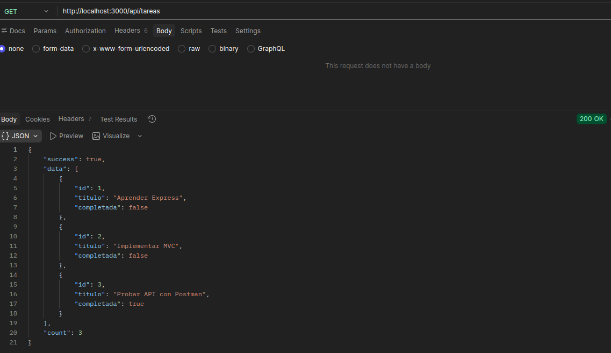
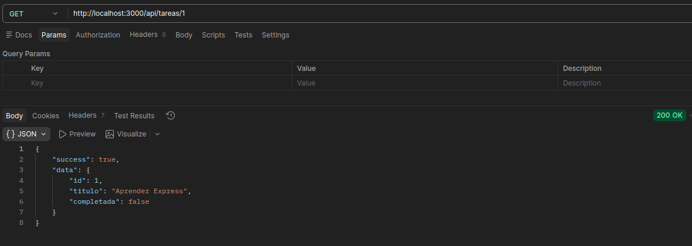
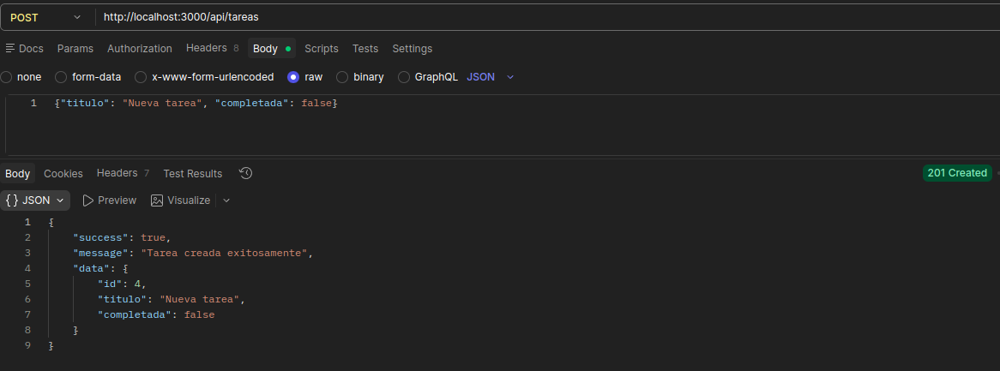
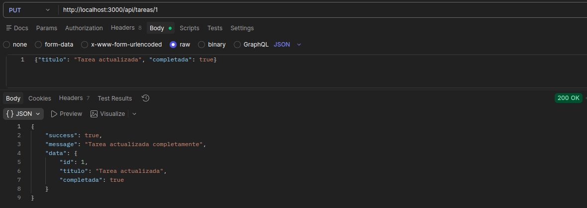
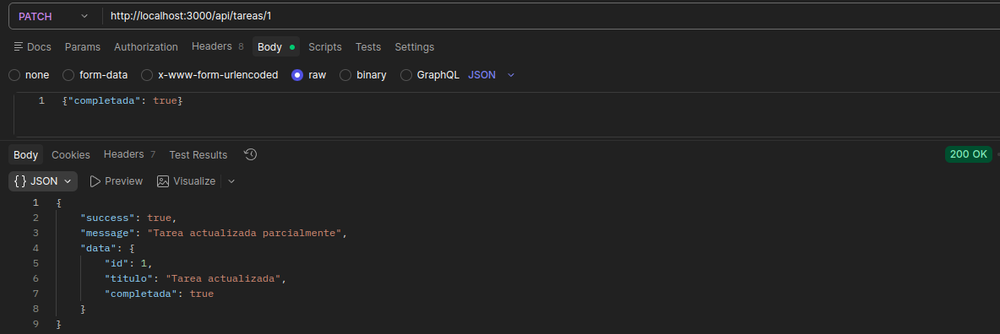
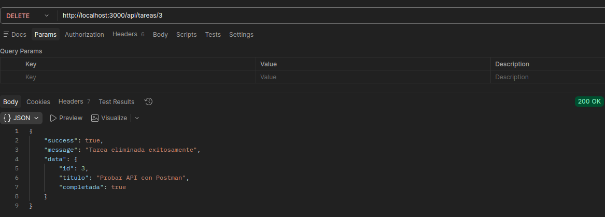
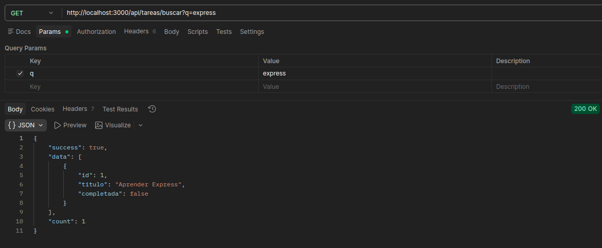
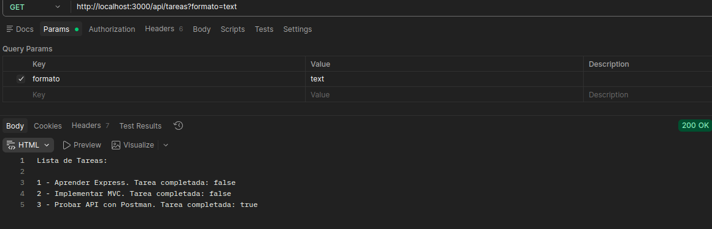

# API REST con Express - Gestión de Tareas (MVC)

**Autor:** Kevin Yassir Felix Sanchez

**Programa:** Ingeniería en Computación 

**Universidad:** Universidad Autónoma de Baja California

**Asignatura:** Desarrollo de Aplicaciones Web 

## Descripción del Proyecto
Esta es una API RESTful desarrollada para gestionar un recurso de "Tareas". La aplicación permite crear, leer, actualizar y eliminar tareas, utilizando únicamente una lista en memoria como persistencia. El proyecto está organizado siguiendo el patrón MVC (Modelo-Vista-Controlador), separando la definición de datos (Modelo), el manejo de peticiones HTTP (Controlador) y la definición de endpoints (Rutas).

## Tecnologías Utilizadas
* Node.js
* Express
* JavaScript

## Instalación

1. Clonar el repositorio: git clone https://github.com/KevinFelix1563/DAW_Meta3.1_FelixKevin
2. Navegar al directorio del proyecto: cd DAW_Meta3.1_FelixKevin
3. Instalar las dependencias: npm install

## Ejecución

Para iniciar el servidor en modo de desarrollo ejecuta:
npm run dev

El servidor estará corriendo en http://localhost:3000.

## Endpoints Disponibles

* **GET** `/api/tareas` - Obtener todas las tareas.
* **GET** `/api/tareas/:id` - Obtener una tarea por ID.
* **POST** `/api/tareas` - Crear una nueva tarea.
* **PUT** `/api/tareas/:id` - Actualizar tarea completamente.
* **PATCH** `/api/tareas/:id` - Actualizar tarea parcialmente.
* **DELETE** `/api/tareas/:id` - Eliminar una tarea.

### Funcionalidades Extra
* **GET** `/api/tareas/buscar?q=termino` - Permite buscar tareas por título (parcial, case insensitive).
* **GET** `/api/tareas?formato=text` - Devuelve texto plano en lugar de JSON al incluir el parámetro de formato.

## Pruebas y Colección de Postman
En la raíz de este repositorio se incluye el archivo `http-test-collection.json`. Este archivo contiene la colección de peticiones HTTP utilizada para probar los endpoints.

* **GET** `/api/tareas` 

* **GET** `/api/tareas/:id`

* **POST** `/api/tareas`

* **PUT** `/api/tareas/:id`

* **PATCH** `/api/tareas/:id`

* **DELETE** `/api/tareas/:id`

* **GET** `/api/tareas/buscar?q=termino`

* **GET** `/api/tareas?formato=text`

